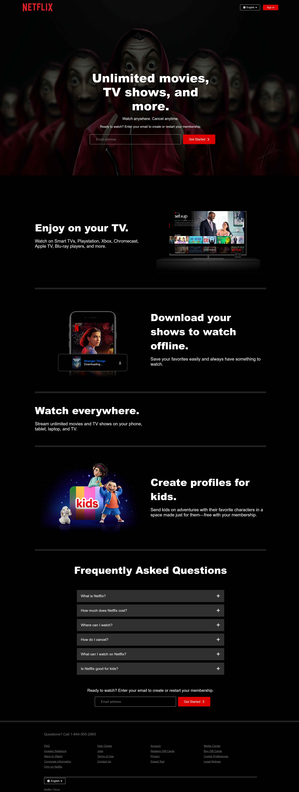

# 🎬 Netflix UI Clone (Pure HTML/CSS)

A pixel-perfect Netflix homepage clone built exclusively with **HTML5** and **CSS3**, designed to demonstrate advanced CSS techniques without JavaScript.

  
*Responsive preview across devices*

## 📖 Detailed Table of Contents

1. **✨ Key Features**  
   - UI components breakdown  
   - Responsive design approach  
   - Performance optimizations

2. **💻 Technology Stack**  
   - Core languages used  
   - Design tools  
   - Version control system

3. **🚀 Project Setup**  
   - Local development guide  
   - Deployment options  
   - Browser compatibility

4. **🎨 Customization Guide**  
   - Theme variables reference  
   - Image replacement  
   - Style modifications

5. **📚 Learning Documentation**  
   - Key skills acquired  
   - Challenges solved  
   - Resources used

6. **❓ Frequently Asked Questions**  
   - Common setup issues  
   - Design decisions explained  
   - Roadmap preview

7. **📜 License Information**  
   - Usage rights  
   - Attribution requirements  
   - Contribution guidelines  

---

## ✨ Features

### Core UI Components
| Component          | Implementation Details                  |
|--------------------|----------------------------------------|
| **Hero Section**   | Gradient overlay + background parallax effect |
| **Navigation Bar** | Flexbox layout with responsive spacing |
| **Language Picker**| Custom dropdown with Font Awesome icons |
| **Email Form**     | Pure CSS validation states (`:valid`/`:invalid`) |

### Responsive Breakpoints
```css
/* Mobile (Default) */
@media (min-width: 576px) { /* Tablet */ }
@media (min-width: 992px) { /* Desktop */ }
```
---
### 🚨 WARNING: README OVERLOAD 

Congrats, you scrolled to the bottom! Now:

1. **STOP STARING** at this README    
2. **STOP ASKING** why there's no JavaScript - IT'S PURE CSS, OKAY? 😤 
---
